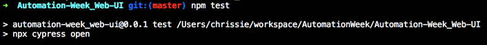
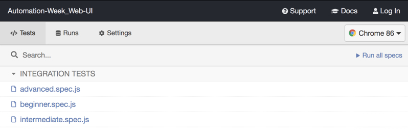
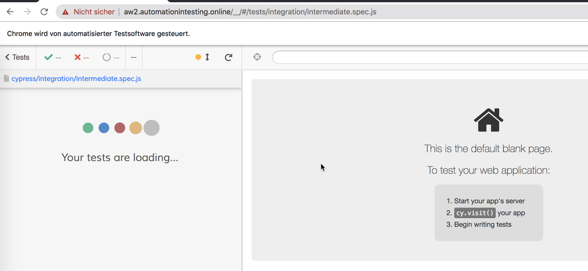
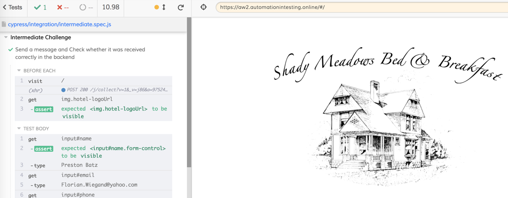

 
# Automation-Week_Web-UI

This repo is solving the Automation Week Challenges that is focused on Web UI automation from the Ministry of Testing. (https://club.ministryoftesting.com/t/automation-week-challenges-web-ui/43665)

# Restful Booker Platform
The sample website application for this challenge [Restful Brooker Platform](https://automationintesting.online/) is kindly provided by [Mark Winteringham](https://twitter.com/2bittester) / [Richard Bradshaw](https://twitter.com/FriendlyTester).

# The Challenges :

## Beginner:
Create an automated test that completes the contact us form on the homepage, submits it, and asserts that the form was completed successfully.

## Intermediate:
Create an automated test that reads a message on the admin side of the site.

You’ll need to trigger a message in the first place, login as admin, open that specific message and validate its contents.

## Advanced:
Create an automated test where a user successfully books a room from the homepage.

You’ll have to click ‘Book this Room’, drag over dates you wish to book, complete the required information and submit the booking.

# How to start the test

1. Clone this repository 
2. Execute 'npm install' in your local folder to install all dependencies (including cypress.io)
3. Execute 'npm test' to start the cypress test runner

4. Cypress is opening  

5. Select one of the tests and double-click on it
6. The test will automatically start and execute the defined assertions and steps

7. At the end you can see the results of the executed tests

# Contact

You can find me on [Twitter](https://twitter.com/ChrisZie_).

# LICENSE

[MIT](LICENSE).
