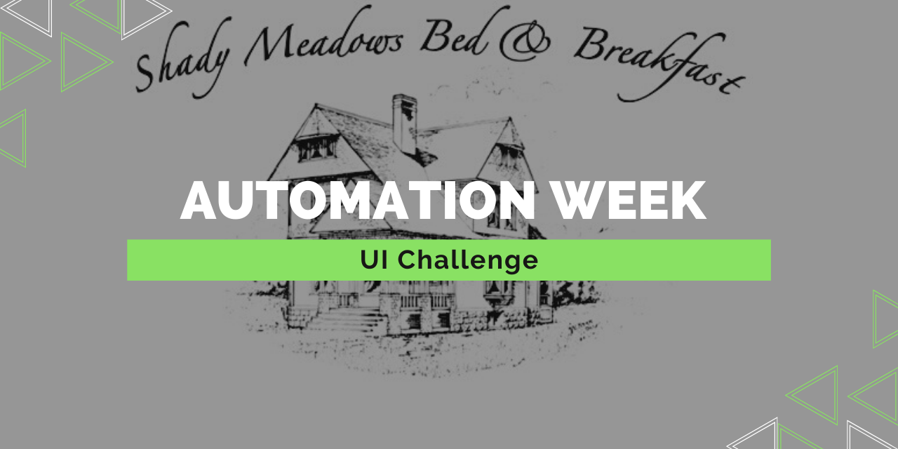
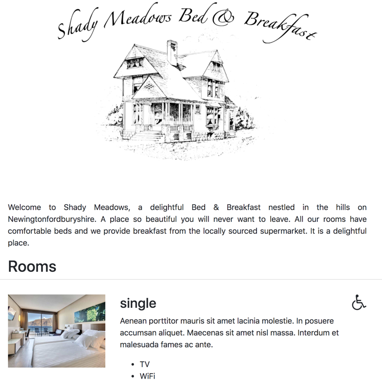

# Automation-Week_Web-UI

This repo is solving the Automation Week Challenges that is focused on Web UI automation from the Ministry of Testing. (https://club.ministryoftesting.com/t/automation-week-challenges-web-ui/43665)

# Restful Booker Platform
The sample website application for this challenge [Restful Brooker Platform](https://automationintesting.online/) is kindly provided by [Mark Winteringham](https://twitter.com/2bittester) / [Richard Bradshaw](https://twitter.com/FriendlyTester).

# The Challenges :

## Beginner:
Create an automated test that completes the contact us form on the homepage, submits it, and asserts that the form was completed successfully.

## Intermediate:
Create an automated test that reads a message on the admin side of the site.

You’ll need to trigger a message in the first place, login as admin, open that specific message and validate its contents.

## Advanced:
Create an automated test where a user successfully books a room from the homepage.

You’ll have to click ‘Book this Room’, drag over dates you wish to book, complete the required information and submit the booking.

# Contact

You can find me on [Twitter](https://twitter.com/ChrisZie_).

# LICENSE

[MIT](LICENSE).